## 🚀 Projects & Detailed Description

---

### 💱 Currency Converter App

This application provides **real-time currency conversion** between major international currencies including **INR, USD, EUR, and JPY**. It is designed with a clean and intuitive UI that enhances user experience.

🔹 Users can input any value and instantly see converted amounts across all supported currencies.
🔹 Includes a **Dark Mode / Light Mode toggle**, improving usability in different lighting conditions.
🔹 Uses structured layouts and responsive UI components for smooth interaction.
🔹 Focuses on **UI/UX design principles**, data handling, and dynamic updates.

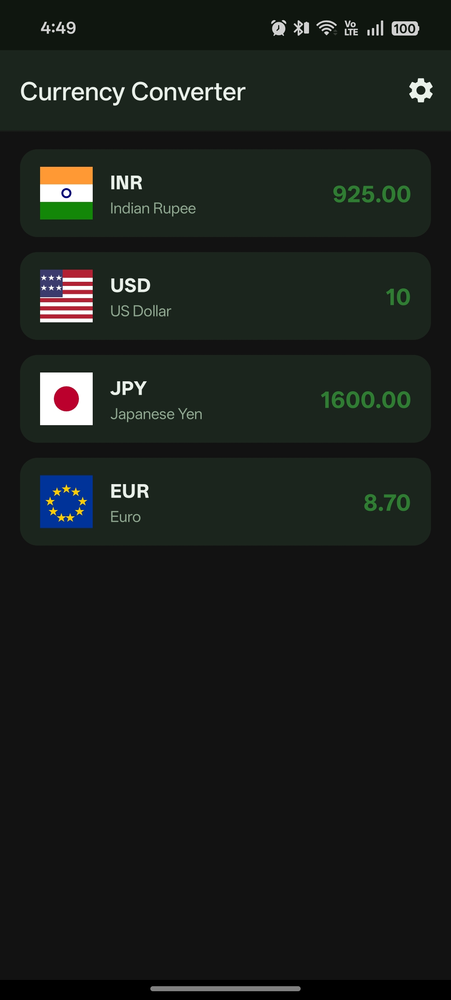
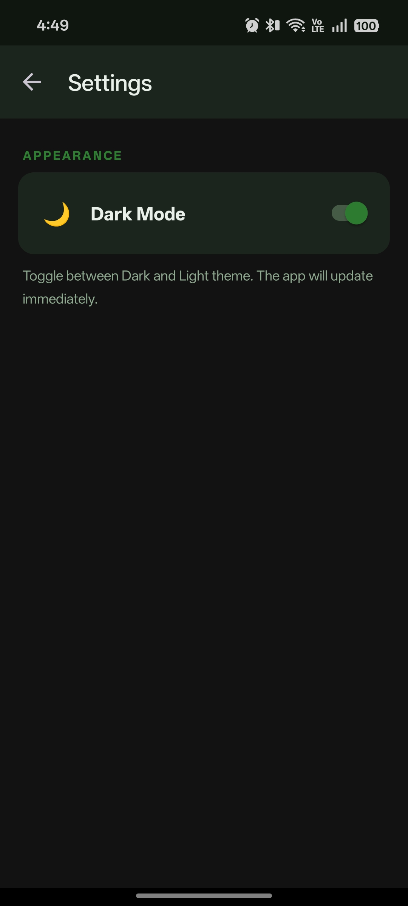
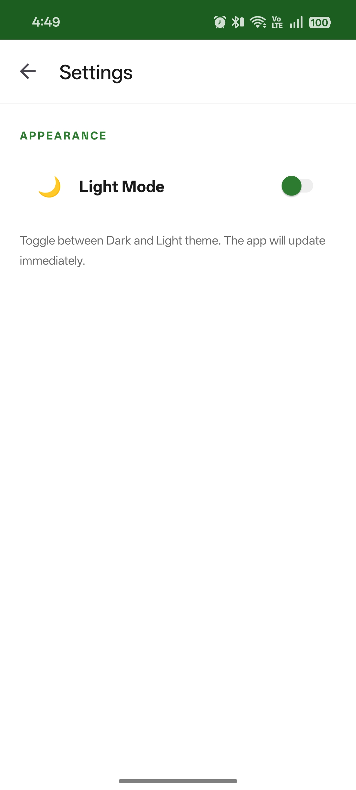
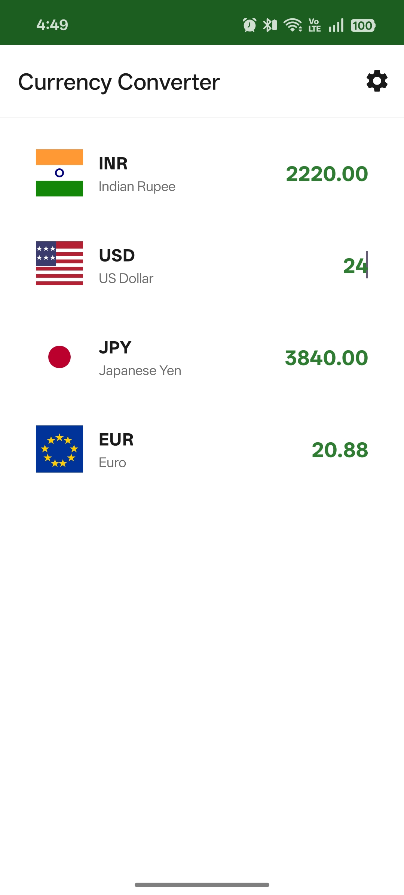

---

### 🎵 Media Player App

This application is a **complete multimedia player** that allows users to play both **audio and video content** efficiently.

🔹 Users can **import media files from device storage** or stream content using a **URL link**.
🔹 Provides full playback controls including **Play, Pause, Stop, and Restart**.
🔹 Displays playback progress using a **seek bar for better control**.
🔹 Handles both offline and online media, showcasing **media APIs and streaming concepts**.
🔹 Built with a structured UI for easy navigation and seamless interaction.

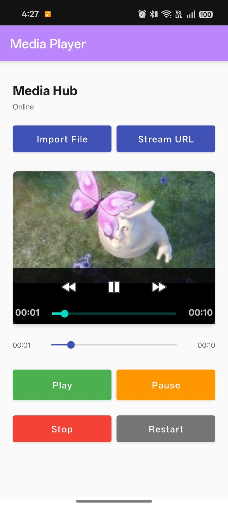
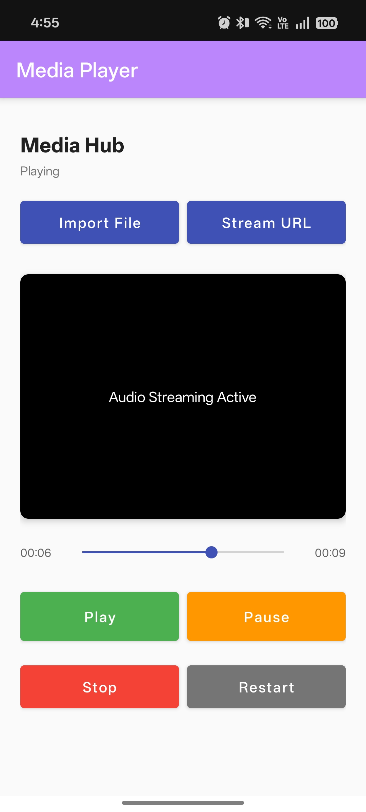
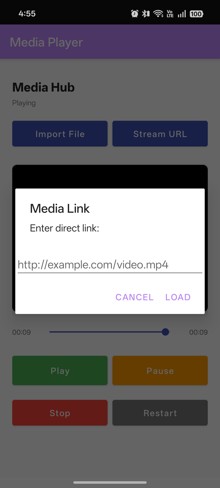
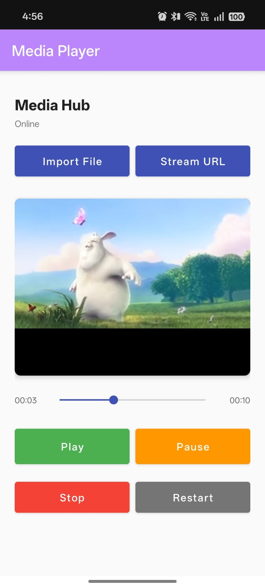

---

### 📡 Sensor App

This application demonstrates the use of **hardware sensors available in Android devices** and displays real-time sensor data.

🔹 Integrates multiple sensors including:
• **Accelerometer** (measures motion in X, Y, Z axes)
• **Light Sensor** (detects ambient light intensity in lux)
• **Proximity Sensor** (detects nearby objects)

🔹 Displays **live sensor readings dynamically**.
🔹 Shows calculated values like **magnitude of acceleration**.
🔹 Helps understand **interaction between software and device hardware**.
🔹 Useful for learning **sensor APIs and real-time data updates**.

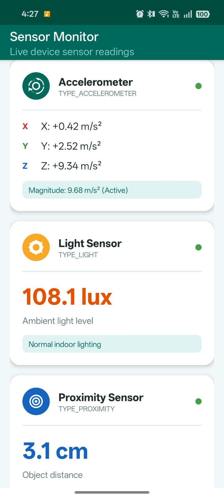

---

### 📸 Photo Gallery App

This application is a fully functional **photo management system** that allows users to capture, store, and manage images efficiently.

🔹 Users can **capture images using the device camera**.
🔹 Allows selection of a **custom storage folder**.
🔹 Displays images in a **grid-based gallery layout**.
🔹 Provides detailed information about each image including:
• File name
• Path
• Size
• Date captured

🔹 Includes functionality to **delete images with confirmation dialog**.
🔹 Demonstrates **file handling, storage permissions, and media management** in Android.

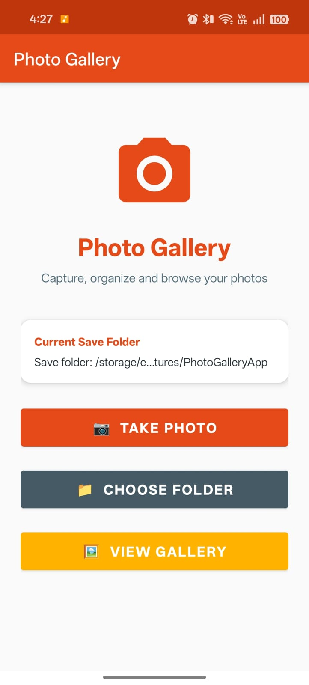
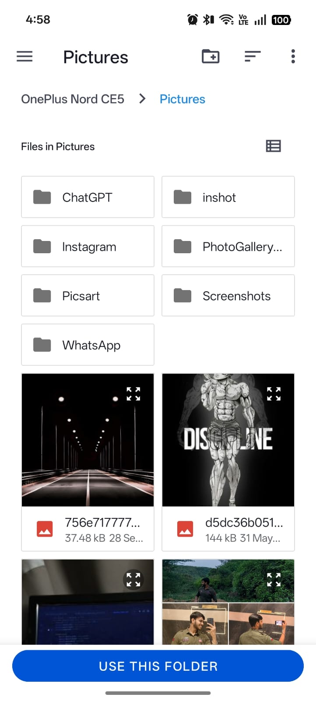
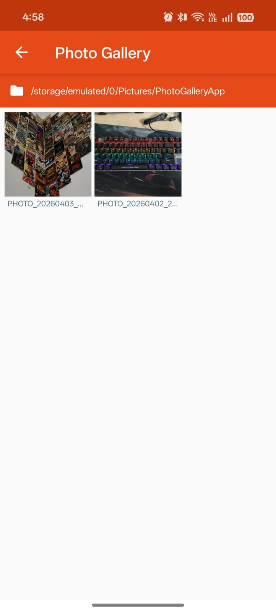
 
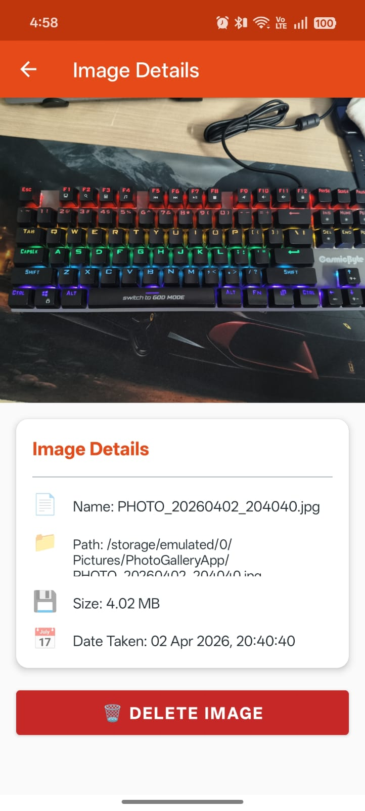
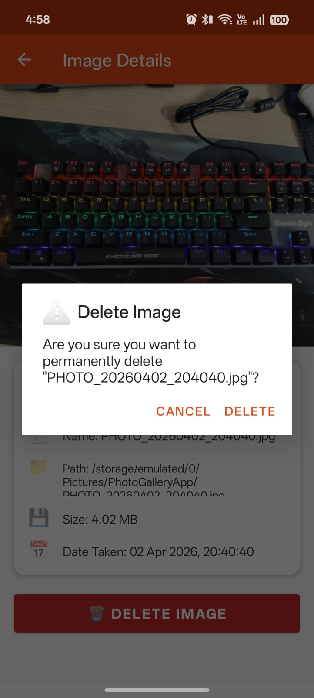

---
